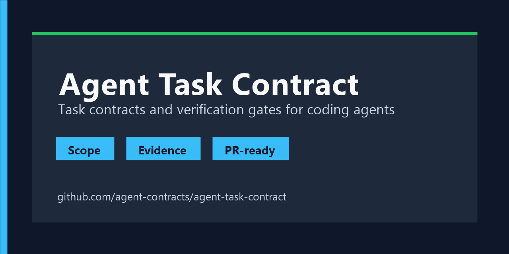

# Agent Task Contract



English | [简体中文](README.zh-CN.md)

`agent-task-contract` is a skill for coding agents that keeps repository work scoped, verifiable, and ready for review.

It gives an agent a lightweight workflow for:

- defining the task before editing
- keeping non-goals and scope boundaries visible
- choosing verification that matches the risk of the change
- recording useful failure context instead of blindly retrying commands
- handing off changes with clear test evidence and PR notes

## Repository Layout

```text
agent-task-contract/
  SKILL.md
  agents/openai.yaml
  references/
  scripts/inspect-repo.mjs
scripts/
  validate-skill.mjs
.github/
  workflows/validate.yml
  PULL_REQUEST_TEMPLATE.md
```

## Install

Copy or symlink the `agent-task-contract` folder into the skill directory used by your agent runtime.

For Codex-style local skills:

```powershell
Copy-Item -Recurse .\agent-task-contract $env:USERPROFILE\.codex\skills\
```

For Claude Code, OpenClaw, or other agent tools, keep `SKILL.md`, `references/`, and `scripts/` together and place the folder where that tool loads skills or plugins.

## Validate

```powershell
npm run validate
```

Inspect a repository before using the skill:

```powershell
npm run inspect
```

## Example Prompts

```text
Use $agent-task-contract to fix this failing test and show the verification evidence.
```

```text
Use $agent-task-contract to prepare this repo change for a PR-ready handoff.
```

## Contributing

Keep the skill folder focused on runtime instructions. Put detailed checklists in `references/`, deterministic helpers in `scripts/`, and repository maintenance files at the project root.

Before opening a PR, run:

```powershell
npm run validate
```
